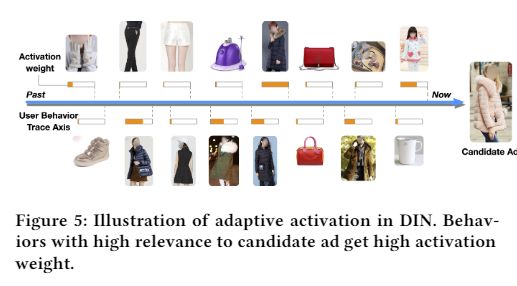
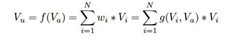
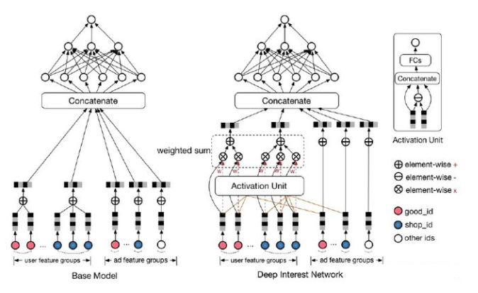
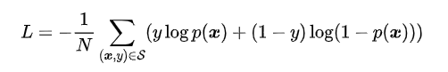
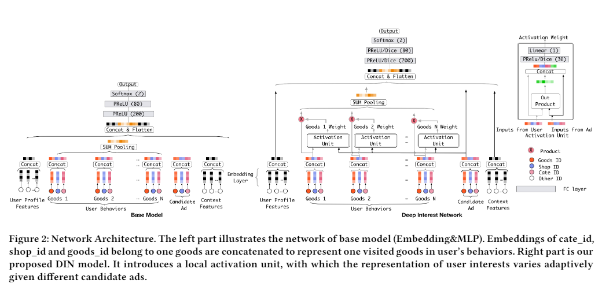
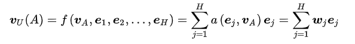

# 【关于 阿里深度兴趣网络（DIN）】 那些你不知道的事

> 作者：杨夕
> 
> 项目地址：https://github.com/km1994/RS_paper_study
> 
> 论文：Deep Interest Network for Click-Through Rate Prediction
> 
> 论文地址：https://arxiv.org/pdf/1706.06978
> 
> 个人介绍：大佬们好，我叫杨夕，该项目主要是本人在研读顶会论文和复现经典论文过程中，所见、所思、所想、所闻，可能存在一些理解错误，希望大佬们多多指正。

## 一、摘要

Click-through  rate  prediction  is  an  essential  task  in  industrialapplications, such as online advertising. Recently deep learningbased models have been proposed, which follow a similar Embed-ding&MLP paradigm. In these methods large scale sparse inputfeatures are first mapped into low dimensional embedding vectors,and then transformed into fixed-length vectors in a group-wisemanner, finally concatenated together to fed into a multilayer per-ceptron (MLP) to learn the nonlinear relations among features. Inthis way, user features are compressed into a fixed-length repre-sentation vector, in regardless of what candidate ads are. The useof fixed-length vector will be a bottleneck, which brings difficultyfor Embedding&MLP methods to capture user’s diverse interestseffectively from rich historical behaviors. In this paper, we proposea novel model: Deep Interest Network (DIN) which tackles this chal-lenge by designing a local activation unit to adaptively learn therepresentation of user interests from historical behaviors with re-spect to a certain ad. This representation vector varies over differentads, improving the expressive ability of model greatly. Besides, wedevelop two techniques: mini-batch aware regularization and dataadaptive activation function which can help training industrial deepnetworks with hundreds of millions of parameters. Experiments ontwo public datasets as well as an Alibaba real production datasetwith over 2 billion samples demonstrate the effectiveness of pro-posed approaches, which achieve superior performance comparedwith state-of-the-art methods. DIN now has been successfully de-ployed in the online display advertising system in Alibaba, servingthe main traffic

- 任务：点击率预测
- 前沿方法介绍：基于深度学习的模型，该模型遵循类似的嵌入ding和MLP范式。
  - 思路：
    - 首先将大规模稀疏输入特征映射为低维嵌入向量；
    - 然后分组变换为定长向量；
    - 最后拼接成多层感知器（MLP），学习特征之间的非线性关系。
  - 优点：通过这种方式，用户特征被压缩成一个固定长度的表示向量，而不管候选广告是什么。
  - 缺点：固定长度向量的使用将成为一个瓶颈，这给嵌入和MLP方法从丰富的历史行为中有效地捕获用户的不同兴趣带来了困难。

- 论文方法：深度兴趣网络（Deep Interest Network，DIN）
  - 思路：通过设计一个局部激活单元，自适应地学习用户兴趣的表示，从历史行为到某个特定的广告，这种表示向量在不同的状态下变化，大大提高了模型的表达能力。
  - 开发了两种技术：小批量感知正则化和数据自适应激活函数，可以帮助训练具有数亿参数的工业深度网络。
  - 实验结果：在两个公共数据集和一个超过20亿样本的阿里巴巴真实生产数据集上的实验表明了所提方法的有效性，其性能优于现有的方法。目前，DIN已成功部署在阿里巴巴的在线展示广告系统中，服务于主要业务。

## 二、用户场景介绍

- 场景介绍：在一个电商网站或APP中给用户推荐广告
- 数据介绍：用户的行为序列历史数据【点击，添加购物车等】

> 用户的行为序列

- 动机：女生的行为历史：从最左边的手套，鞋子到右边的杯子，睡衣。要被推荐的候选商品是一件女式大衣。我们应该如何计算这件大衣的CTR呢？

## 三、注意力机制介绍

- 方式：模型在预测的时候，对用户不同行为的注意力是不一样的，“相关”的行为历史看重一些，“不相关”的历史甚至可以忽略；
- 公式介绍

> $V_u$ 是用户的embedding向量， $V_a$ 是候选广告商品的embedding向量， $V_i$ 是用户u的第i次行为的embedding向量，因为这里用户的行为就是浏览商品或店铺，所以行为的embedding的向量就是那次浏览的商品或店铺的embedding向量。

因为加入了注意力机制， $V_u$ 从过去 $V_i$ 的加和变成了 $V_i$ 的加权和， $V_i$ 的权重 $w_i$ 就由 $V_i$ 与 $V_a$ 的关系决定，也就是上式中的 $g(V_i,V_a)$ ，不负责任的说，这个 $g(V_i,V_a)$ 的加入就是本文70%的价值所在。

## 四、基础模型（Embedding&MLP）

### 4.1 Embedding层

Embedding运算遵循表查找机制。

### 4.2 Pooling层和Concat层

不同用户有不同个数的行为。全连接层通常要求处理固定长度的输入，因此实践上经常将Embedding向量列表通过pooling层变换为固定长度的向量。pooling层通常有sum pooling和average pooling。

### 4.3 MLP

Wide&Deep，PNN，DeepFM都是聚焦于设计MLP结构来更好的提取信息。

### 4.4 Loss

## 五、DIN结构

- 动机：通过pooling得到的表示向量对于给定用户都是相同的，而没有考虑候选广告是什么。这种情况下，有限维度的用户表示向量将成为表达用户多样兴趣的瓶颈。也不能简单的直接扩展维度，这样会带来过拟合及计算资源的消耗。

- 目标：考虑候选广告和历史行为的相关性来自适应的计算用户兴趣的表示向量
- 方法：
  - 除了引入新设计的局部激活单元外，和基础模型结构几乎一致。如等式3所示，根据给定的候选广告$A$，通过有权重的sum pooling来自适应的计算用户表示$\boldsymbol{v}_{U}$

> 注：H 为用户 U 的行为Embedding向量列表

## 六、总结

- 要解决什么问题？
  
多样的用户兴趣与候选广告的相关性

- 用了什么方法解决？
  
提出DIN网络，核心是用户行为序列与候选item做Attention

- 效果如何？
用户加权AUC和线上效果均有提升，但绝对数值上没有那么大

- 还存在什么问题？
因为每个候选item都要与行为序列上的所有item做Attention，当候选item量级很大时计算量上有点不可控，比方说不能用于召回层

- 算法背后的模式和原理？
Attention思路的延续和应用

## 参考

1. [论文笔记 | KDD2018 | Deep Interest Network for Click-Through Rate Prediction](https://www.jianshu.com/p/7af364dcea12)
2. [推荐系统中的注意力机制——阿里深度兴趣网络（DIN）](https://zhuanlan.zhihu.com/p/51623339)

