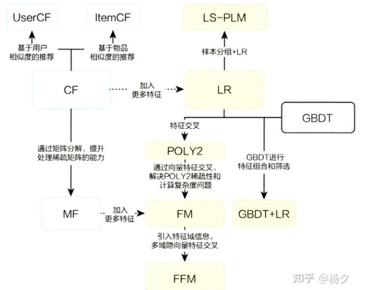
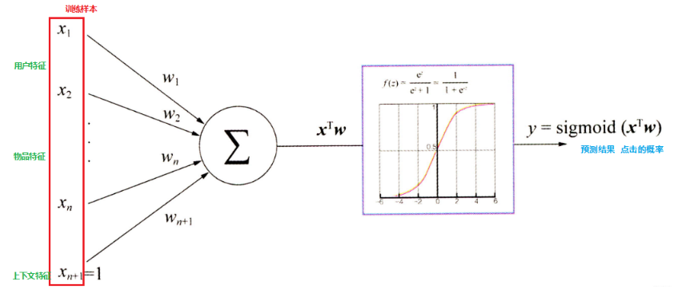
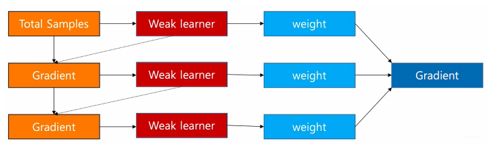
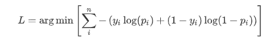
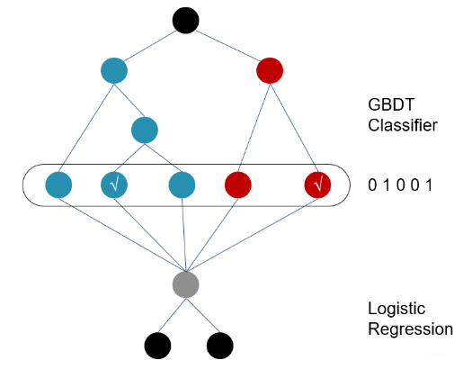

# 【关于 GBDT+LR】 那些你不知道的事

> 作者：杨夕
> 
> 项目地址：https://github.com/km1994/RS_paper_study
> 
> 个人介绍：大佬们好，我叫杨夕，该项目主要是本人在研读顶会论文和复现经典论文过程中，所见、所思、所想、所闻，可能存在一些理解错误，希望大佬们多多指正。

## 一、推荐系统 关系图




## 一、GBDT+LR 模型理论介绍

### 1.1 动机

- 协同过滤和矩阵分解：仅利用了用户与物品相互行为信息进行推荐， 忽视了用户自身特征， 物品自身特征以及上下文信息等，导致生成的结果往往会比较片面。

### 1.2 思路

1. 利用GBDT自动进行特征筛选和组合， 进而生成新的离散特征向量；
2. 把该特征向量当做LR模型的输入， 来产生最后的预测结果；

### 1.3 优点及适用场景

该模型能够综合利用用户、物品和上下文等多种不同的特征， 生成较为全面的推荐结果， 在CTR点击率预估场景下使用较为广泛。

### 1.4 LR 模型

#### 1.4.1 介绍

逻辑回归假设数据服从伯努利分布,通过极大化似然函数的方法，运用梯度下降来求解参数，来达到将数据二分类的目的。

#### 1.4.2 vs 协同过滤和矩阵分解

协同过滤和矩阵分解：利用用户的物品“相似度”进行推荐；
逻辑回归模型：将问题看成了一个分类问题， 通过预测正样本的概率对物品进行排序；

#### 1.4.3 流程

1. 将用户年龄、性别、物品属性、物品描述、当前时间、当前地点等特征转成数值型向量；
2. 确定逻辑回归的优化目标，比如把点击率预测转换成二分类问题， 这样就可以得到分类问题常用的损失作为目标， 训练模型；
3. 在预测的时候， 将特征向量输入模型产生预测， 得到用户“点击”物品的概率；
4. 利用点击概率对候选物品排序， 得到推荐列表。



#### 1.4.4 计算流程

1. 先随机初始化参数$w$；
2. 将特征向量（也就是我们上面数值化出来的特征）输入到模型， 就会通过计算得到模型的预测概率；
3. 通过对目标函数求导得到每个$w$的梯度， 然后进行更新$w$

#### 1.4.5 目标函数

- 目标函数
 
$$J(w)=-\frac{1}{m}\left(\sum_{i=1}^{m}\left(y^{i} \log f_{w}\left(x^{i}\right)+\left(1-y^{i}\right) \log \left(1-f_{w}\left(x^{i}\right)\right)\right)\right.$$

求导后的目标函数

$$w_{j} \leftarrow w_{j}-\gamma \frac{1}{m} \sum_{i=1}^{m}\left(f_{w}\left(x^{i}\right)-y^{i}\right) x_{j}^{i}$$

这样通过若干次迭代， 就可以得到最终的$w$了。

#### 1.4.6 优点

1. LR模型形式简单，可解释性好，从特征的权重可以看到不同的特征对最后结果的影响。
2. 训练时便于并行化，在预测时只需要对特征进行线性加权，所以性能比较好，往往适合处理海量id类特征，用id类特征有一个很重要的好处，就是防止信息损失（相对于范化的 CTR 特征），对于头部资源会有更细致的描述
3. 资源占用小,尤其是内存。在实际的工程应用中只需要存储权重比较大的特征及特征对应的权重。
4. 方便输出结果调整。逻辑回归可以很方便的得到最后的分类结果，因为输出的是每个样本的概率分数，我们可以很容易的对这些概率分数进行cutoff，也就是划分阈值(大于某个阈值的是一类，小于某个阈值的是一类)

#### 1.4.7 缺点

1. 表达能力不强， 无法进行特征交叉， 特征筛选等一系列“高级“操作（这些工作都得人工来干， 这样就需要一定的经验， 否则会走一些弯路）， 因此可能造成信息的损失
2. 准确率并不是很高。因为这毕竟是一个线性模型加了个sigmoid， 形式非常的简单(非常类似线性模型)，很难去拟合数据的真实分布
3. 处理非线性数据较麻烦。逻辑回归在不引入其他方法的情况下，只能处理线性可分的数据， 如果想处理非线性， 首先对连续特征的处理需要先进行离散化（离散化的目的是为了引入非线性），如上文所说，人工分桶的方式会引入多种问题。
4. LR 需要进行人工特征组合，这就需要开发者有非常丰富的领域经验，才能不走弯路。这样的模型迁移起来比较困难，换一个领域又需要重新进行大量的特征工程。

### 1.5 梯度提升决策树（GBDT）模型

#### 1.5.1 介绍

- 思路：通过采用加法模型(即基函数的线性组合），以及不断减小训练过程产生的误差来达到将数据分类或者回归的算法， 其训练过程如下：



> 通过多轮迭代， 每轮迭代会产生一个弱分类器， 每个分类器在上一轮分类器的残差基础上进行训练。 GBDT 对弱分类器的要求一般是足够简单， 并且低方差高偏差。 因为训练的过程是通过降低偏差来不断提高最终分类器的精度。 由于上述高偏差和简单的要求，每个分类回归树的深度不会很深。最终的总分类器是将每轮训练得到的弱分类器加权求和得到的（也就是加法模型）。
- 特点：每轮的训练是在上一轮的训练的残差基础之上进行训练的**， 而这里的残差指的就是当前模型的负梯度值， 这个就要求每轮迭代的时候，弱分类器的输出的结果相减是有意义的；
- 分类器：CART 回归树

#### 1.5.2 解决二分类和回归问题的方式

通过不断构建决策树的方式，使预测结果一步步的接近目标值， 但是二分类问题和回归问题的损失函数是不同的。

#### 1.5.3 损失函数

- 回归问题：平方损失
-  二分类问题：



> 其中， $y_i$是第$i$个样本的观测值， 取值要么是0要么是1， 而$p_i$是第$i$个样本的预测值， 取值是0-1之间的概率，由于我们知道GBDT拟合的残差是当前模型的负梯度，

#### 1.5.4 构建分类GBDT的步骤

1. 初始化GBDT

和回归问题一样， 分类 GBDT 的初始状态也只有一个叶子节点，该节点为所有样本的初始预测值，如下：

$$F_{0}(x)=\arg \min {\gamma} \sum{i=1}^{n} L(y, \gamma)$$

> 上式里面， $F$代表GBDT模型， $F_0$是模型的初识状态， 该式子的意思是找到一个$\gamma$，使所有样本的 Loss 最小，在这里及下文中，$\gamma$都表示节点的输出，即叶子节点， 且它是一个 $log(\eta_i)$ 形式的值(回归值)，在初始状态，$\gamma =F_0$。

2. 循环生成决策树
3. 第一就是计算负梯度值得到残差;
   
$$r_{i m}=-\left[\frac{\partial L\left(y_{i}, F\left(x_{i}\right)\right)}{\partial F\left(x_{i}\right)}\right]{F(x)=F{m-1}(x)}$$

> 使用$m-1$棵树的模型， 计算每个样本的残差$r_{im}$, 就是上面的$y_i-pi$;

4. 第二步是用回归树拟合残差$r_{im}$

这里的$i$表示样本哈，回归树的建立过程可以参考下面的链接文章，简单的说就是遍历每个特征， 每个特征下遍历每个取值， 计算分裂后两组数据的平方损失， 找到最小的那个划分节点。

5. 第三步对于每个叶子节点$j$, 计算最佳残差拟合值
   
$$\gamma_{j m}=\arg \min {\gamma} \sum{x \in R_{i j}} L\left(y_{i}, F_{m-1}\left(x_{i}\right)+\gamma\right)$$

在刚构建的树$m$中， 找到每个节点$j$的输出$\gamma_{jm}$, 能使得该节点的loss最小

1. 第四步是 更新模型$F_m(x)$

$$F_{m}(x)=F_{m-1}(x)+\nu \sum_{j=1}^{J_{m}} \gamma_{m}$$

这样， 通过多次循环迭代， 就可以得到一个比较强的学习器$F_m(x)$

#### 1.5.5 优缺点

- 优点：把树的生成过程理解成自动进行多维度的特征组合的过程，从根结点到叶子节点上的整个路径(多个特征值判断)，才能最终决定一棵树的预测值， 另外，对于连续型特征的处理，GBDT 可以拆分出一个临界阈值，比如大于 0.027 走左子树，小于等于 0.027（或者 default 值）走右子树，这样很好的规避了人工离散化的问题。这样就非常轻松的解决了逻辑回归那里自动发现特征并进行有效组合的问题；
- 缺点： 对于海量的 id 类特征，GBDT 由于树的深度和棵树限制（防止过拟合），不能有效的存储；另外海量特征在也会存在性能瓶颈，当 GBDT 的 one hot 特征大于 10 万维时，就必须做分布式的训练才能保证不爆内存。所以 GBDT 通常配合少量的反馈 CTR 特征来表达，这样虽然具有一定的范化能力，但是同时会有信息损失，对于头部资源不能有效的表达。

### 1.6 GBDT+LR 模型

#### 1.6.1 动机

- LR:
  - 思路：使用了Sigmoid变换将函数值映射到0~1区间，映射后的函数值就是CTR的预估值；
  - 优点：属于线性模型，容易并行化，可以轻松处理上亿条数据
  - 缺点：学习能力十分有限，需要大量的特征工程来增加模型的学习能力。但大量的特征工程耗时耗力同时并不一定会带来效果提升；
- FM模型：
  - 思路：通过隐变量的方式，发现两两特征之间的组合关系；
  - 缺点：这种特征组合仅限于两两特征之间

#### 1.6.2 问题引入

- 问题1：为什么要使用集成的决策树模型，而不是单棵的决策树模型？
  - 解答：一棵树的表达能力很弱，不足以表达多个有区分性的特征组合，多棵树的表达能力更强一些。可以更好的发现有效的特征和特征组合；
- 问题2：为什么建树采用GBDT而非RF？
  - 解答：RF也是多棵树，但从效果上有实践证明不如GBDT。且GBDT前面的树，**特征分裂主要体现对多数样本有区分度的特征；后面的树，主要体现的是经过前N颗树，残差仍然较大的少数样本。优先选用在整体上有区分度的特征，再选用针对少数样本有区分度的特征**，思路更加合理，这应该也是用GBDT的原因。

#### 1.6.3 思路

1. 利用GBDT自动进行特征筛选和组合，进而生成新的离散特征向量；
2. 再把该特征向量当做LR模型的输入， 来产生最后的预测结果；


> 注：图中共有两棵树，x为一条输入样本，遍历两棵树后，x样本分别落到两颗树的叶子节点上，每个叶子节点对应LR一维特征，那么通过遍历树，就得到了该样本对应的所有LR特征。构造的新特征向量是取值0/1的。举例来说：上图有两棵树，左树有三个叶子节点，右树有两个叶子节点，最终的特征即为五维的向量。对于输入x，假设他落在左树第一个节点，编码[0,1,0]，落在右树第二个节点则编码[0,1]，所以整体的编码为[0,1,0,0,1]，这类编码作为特征，输入到LR中进行分类。

#### 1.6.4 步骤

- 训练时，GBDT 建树的过程相当于自动进行的特征组合和离散化，然后从根结点到叶子节点的这条路径就可以看成是不同特征进行的特征组合，用叶子节点可以唯一的表示这条路径，并作为一个离散特征传入 LR 进行二次训练。

比如上图中， 有两棵树，x为一条输入样本，遍历两棵树后，x样本分别落到两颗树的叶子节点上，每个叶子节点对应LR一维特征，那么通过遍历树，就得到了该样本对应的所有LR特征。构造的新特征向量是取值0/1的。 比如左树有三个叶子节点，右树有两个叶子节点，最终的特征即为五维的向量。对于输入x，假设他落在左树第二个节点，编码[0,1,0]，落在右树第二个节点则编码[0,1]，所以整体的编码为[0,1,0,0,1]，这类编码作为特征，输入到线性分类模型（LR or FM）中进行分类。

- 预测时，会先走 GBDT 的每棵树，得到某个叶子节点对应的一个离散特征(即一组特征组合)，然后把该特征以 one-hot 形式传入 LR 进行线性加权预测。

#### 7.6.3 关键点

1. 通过GBDT进行特征组合之后得到的离散向量是和训练数据的原特征一块作为逻辑回归的输入， 而不仅仅全是这种离散特征
2. 建树的时候用ensemble建树的原因就是一棵树的表达能力很弱，不足以表达多个有区分性的特征组合，多棵树的表达能力更强一些。GBDT每棵树都在学习前面棵树尚存的不足，迭代多少次就会生成多少棵树。
3. RF也是多棵树，但从效果上有实践证明不如GBDT。且GBDT前面的树，特征分裂主要体现对多数样本有区分度的特征；后面的树，主要体现的是经过前N颗树，残差仍然较大的少数样本。优先选用在整体上有区分度的特征，再选用针对少数样本有区分度的特征，思路更加合理，这应该也是用GBDT的原因。
4. 在CRT预估中， GBDT一般会建立两类树(非ID特征建一类， ID类特征建一类)， AD，ID类特征在CTR预估中是非常重要的特征，直接将AD，ID作为feature进行建树不可行，故考虑为每个AD，ID建GBDT树。
5. 非ID类树：不以细粒度的ID建树，此类树作为base，即便曝光少的广告、广告主，仍可以通过此类树得到有区分性的特征、特征组合
6. ID类树：以细粒度 的ID建一类树，用于发现曝光充分的ID对应有区分性的特征、特征组合

## 二、GBDT+LR 模型实践介绍

### 2.1 加载数据集

首先读取数据集

```s
# 读取数据
def preProcess():
    path = 'data/'
    df_train = pd.read_csv(path + 'train.csv')
    df_test = pd.read_csv(path + 'test.csv')
    df_train.drop(['Id'], axis = 1, inplace = True)
    df_test.drop(['Id'], axis = 1, inplace = True)
    df_test['Label'] = -1
    data = pd.concat([df_train, df_test])
    data = data.fillna(-1)
    data.to_csv('data/data.csv', index = False)
    return data
```
### 2.2 GBDT 模型定义和训练

#### 2.2.1 类别特征one-hot编码

```s
  # 类别特征one-hot编码
  for col in category_feature:
      onehot_feats = pd.get_dummies(data[col], prefix = col)
      data.drop([col], axis = 1, inplace = True)
      data = pd.concat([data, onehot_feats], axis = 1)
```

#### 2.2.2 划分数据集

```s
    train = data[data['Label'] != -1]
    target = train.pop('Label')
    test = data[data['Label'] == -1]
    test.drop(['Label'], axis = 1, inplace = True)

    # 划分数据集
    x_train, x_val, y_train, y_val = train_test_split(train, target, test_size = 0.2, random_state = 2020)

```

#### 2.2.3 GBDT 模型定义

这里采用 LightGBM 作为 GBDT 使用，并构建了 32 棵树，每棵树有 64 个叶子节点

```s
    # 开始训练gbdt，使用100课树，每课树64个叶节点
    model = lgb.LGBMRegressor(objective='binary',
                            subsample= 0.8,
                            min_child_weight= 0.5,
                            colsample_bytree= 0.7,
                            num_leaves=num_leaves,
                            learning_rate=0.05,
                            n_estimators=n_estimators,
                            random_state = 2020)
```

#### 2.2.4 模型训练

```s
    model.fit(x_train, y_train,
            eval_set = [(x_train, y_train), (x_val, y_val)],
            eval_names = ['train', 'val'],
            eval_metric = 'binary_logloss',
            verbose=0)
```

#### 2.2.5 模型预测

```s
    # 得到每一条训练数据落在了每棵树的哪个叶子结点上
    # pred_leaf = True 表示返回每棵树的叶节点序号
    gbdt_feats_train = model.predict(train, pred_leaf = True)
    
    # 打印结果的 shape：
    print(gbdt_feats_train.shape)
    # 打印前5个数据：
    print(gbdt_feats_train[:5])

    # 同样要获取测试集的叶节点索引
    gbdt_feats_test = model.predict(test, pred_leaf = True)
    >>>
    (1599, 32)
    [[ 7  8 13  1 16 17 29  7 12  9 16  5 22  4 27  3 21 21 10 12  2 18 23 19
      25  3 25  7  1 23  9  2]
    [ 1 16 17 12 16 12 17  9  1  1 22 17 34 36 29 29  7  4 16 19 24  7 32 18
      15 38 32 27 32 11 32 37]
    [20 30 24 46 34  2 26 39 24 32 17  2  2  0  2 18  7 39 28 31 22 20 21  0
      15 35 36 34 33 10 34 21]
    [29 20 29 18 42 26 29  6 10  9 20 19 14 43 14 17 23 17 27 16 25 27 42 43
      27 18 43 12 11 21 42 16]
    [ 2 12  8  6  2 34 30  2  2 16 14  5  8 26 15 13 23 12  1  1  7 16 20 40
      22 14 27 28 17 24  7 38]]
```
> (1599, 32) 表示一共有 1599 个训练样本，每个样本都得到32棵树叶节点序号。接下来输出的二维数组就展示了前5条训练数据落在了每棵树的哪个叶子结点上。

### 2.3 LR 模型定义和训练

#### 2.3.1 预处理

将这些叶节点需要进行one-hot编码，以形成LR可以理解的特征

```s
    # 将 32 课树的叶节点序号构造成 DataFrame，方便后续进行 one-hot
    gbdt_feats_name = ['gbdt_leaf_' + str(i) for i in range(n_estimators)]
    df_train_gbdt_feats = pd.DataFrame(gbdt_feats_train, columns = gbdt_feats_name) 
    df_test_gbdt_feats = pd.DataFrame(gbdt_feats_test, columns = gbdt_feats_name)
    train_len = df_train_gbdt_feats.shape[0]
    data = pd.concat([df_train_gbdt_feats, df_test_gbdt_feats])

    # 对每棵树的叶节点序号进行 one-hot
    for col in gbdt_feats_name:
        onehot_feats = pd.get_dummies(data[col], prefix = col)
        data.drop([col], axis = 1, inplace = True)
        data = pd.concat([data, onehot_feats], axis = 1)

```

#### 2.3.2 构造LR的训练和测试数据

```s
    train = data[: train_len]
    test = data[train_len:]
    # 划分 LR 训练集、验证集
    x_train, x_val, y_train, y_val = train_test_split(train, target, test_size = 0.3, random_state = 2018)
```

#### 2.3.3 LR 训练

```s
    # 开始训练lr
    lr = LogisticRegression()
    lr.fit(x_train, y_train)
    tr_logloss = log_loss(y_train, lr.predict_proba(x_train)[:, 1])
    print('tr-logloss: ', tr_logloss)
    val_logloss = log_loss(y_val, lr.predict_proba(x_val)[:, 1])
    print('val-logloss: ', val_logloss)
    >>>
    tr-logloss:  0.05014369593840625
    val-logloss:  0.3134447935137867
```

#### 2.3.4 LR 预测

```s
    # 对测试集预测
    y_pred = lr.predict_proba(test)[:, 1]
```


## 参考

1. [team-learning-rs](https://github.com/datawhalechina/team-learning-rss)