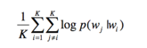
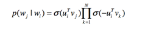
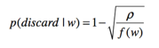

# 【关于 Item2Vec】 那些你不知道的事

> 作者：杨夕
> 
> 项目地址：https://github.com/km1994/RS_paper_study
> 
> 论文：Item2Vec: Neural Item Embedding for Collaborative Filtering
> 
> 论文地址：https://arxiv.org/pdf/1603.04259v2.pdf
> 
> 个人介绍：大佬们好，我叫杨夕，该项目主要是本人在研读顶会论文和复现经典论文过程中，所见、所思、所想、所闻，可能存在一些理解错误，希望大佬们多多指正。

## word2vec 介绍 【网上满大街都是】

## 论文介绍

Item2vec中把用户浏览的商品集合等价于word2vec中的word的序列，即句子（忽略了商品序列空间信息spatial information） 。出现在同一个集合的商品对视为 positive。对于集合 $w_1,..,w_K$ 目标函数：

同word2vec，利用负采样，将 $p(w_j|w_i)$ 定义为：

subsample的方式也是同word2vec：

最终，利用SGD方法学习的目标函数max，得到每个商品的embedding representation，商品之间两两计算cosine相似度即为商品的相似度。

## 参考

