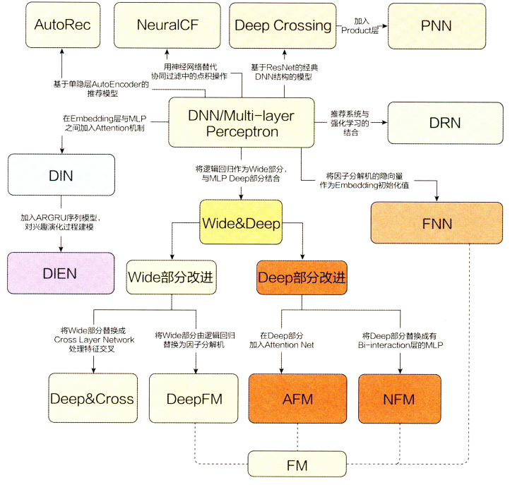
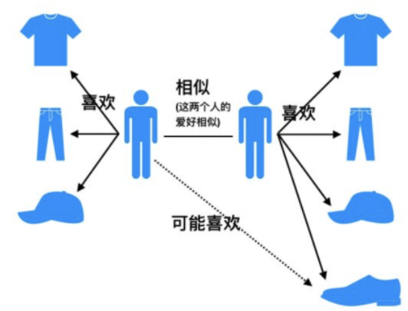
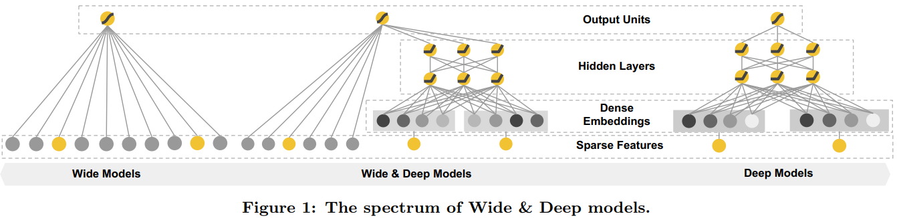

# 【关于 推荐系统】 那些你不知道的事

> 作者：杨夕
> 
> 项目地址：https://github.com/km1994/nlp_paper_study
> 
> 个人介绍：大佬们好，我叫杨夕，该项目主要是本人在研读顶会论文和复现经典论文过程中，所见、所思、所想、所闻，可能存在一些理解错误，希望大佬们多多指正。

## 一、推荐系统 关系图




## 二、大纲

1. 协同过滤算法
- 方法：
  - 基于用户的协同过滤(UserCF)
  - 基于商品的协同过滤(ItemCF)

2. 矩阵分解算法:
- 动机：协同过滤稀疏矩阵问题
- 方法：引入隐向量的概念，来加强模型处理稀疏矩阵的能力

3. FM(Factorization Machines):
- 动机：
  - 逻辑回归的缺点:
    - 是一个线性模型
    - 每个特征对最终输出结果独立，需要手动特征交叉（$x_i*x_j$），比较麻烦
- 思路：在 LR 模型的基础上加上特征交叉项

4. GBDT+LR:
- 动机：
  - 协同过滤和矩阵分解问题：仅利用了用户与物品相互行为信息进行推荐， 忽视了用户自身特征， 物品自身特征以及上下文信息等，导致生成的结果往往会比较片面；
  - FM：FM的二阶特征交叉不能充分利用了特征之间的相关性；
- 思路：
  - **利用GBDT自动进行特征筛选和组合， 进而生成新的离散特征向量**；
  - **把该特征向量当做LR模型的输入， 来产生最后的预测结果**;
- 优点：
  - 该模型能够综合利用用户、物品和上下文等多种不同的特征， 生成较为全面的推荐结果

## 三、协同过滤算法

### 3.1 思想

**根据用户之前的喜好以及其他兴趣相近的用户的选择来给用户推荐物品**(基于对用户历史行为数据的挖掘发现用户的喜好偏向， 并预测用户可能喜好的产品进行推荐)，**一般是仅仅基于用户的行为数据（评价、购买、下载等）, 而不依赖于项的任何附加信息（物品自身特征）或者用户的任何附加信息**（年龄， 性别等）。

### 3.2 方法

#### 3.2.1 基于用户的协同过滤算法(UserCF)

- 思路：向用户推荐和他兴趣相近的其他用户的商品；



> 注：左边用户和右边用户都喜欢相同的商品，那么这个时候 左边用户有可能也喜欢 右边用户所喜欢的鞋子

- 步骤：
  - 寻找和目标用户具有相似兴趣的用户集合；
  - 将这个集合中的用户所喜欢的其他商品推荐给目标用户；

- 适用场景：适于用户少， 物品多， 时效性较强的场合， 比如新闻推荐场景， 因为新闻本身兴趣点分散， 相比用户对不同新闻的兴趣偏好， 新闻的及时性，热点性往往更加重要， 所以正好适用于发现热点，跟踪热点的趋势。

#### 3.2.2 基于物品的协同过滤算法(ItemCF)

- 思路：向用户推荐和他之前感兴趣的商品相似的商品；


> 注：左边用户和右边用户都喜欢上面的商品，那么这个时候 左边用户有可能也喜欢 右边用户所喜欢的下面的商品

- 步骤：
  - 计算物品之间的相似度;
  - 根据物品的相似度和用户的历史行为给用户生成推荐列表（购买了该商品的用户也经常购买的其他商品）;
  
- 适用场景：适用于兴趣变化较为稳定的应用， 更接近于个性化的推荐， 适合**物品少，用户多，用户兴趣固定持久， 物品更新速度不是太快的场合**， 比如推荐艺术品， 音乐， 电影。

### 3.3 存在问题

- 缺点：

1. 数据稀疏性。

举例：一个大型的电子商务推荐系统一般有非常多的物品，用户可能买的其中不到1%的物品，不同用户之间买的物品重叠性较低，导致算法无法找到一个用户的邻居，即偏好相似的用户。**这导致UserCF不适用于那些正反馈获取较困难的应用场景**(如酒店预订， 大件商品购买等低频应用)；

2. 算法扩展性。基于用户的协同过滤需要维护用户相似度矩阵以便快速的找出Topn相似用户， 该矩阵的存储开销非常大，存储空间随着用户数量的增加而增加，**不适合用户数据量大的情况使用**；

3. 没有利用到物品本身或者是用户自身的属性， 仅仅利用了用户与物品的交互信息就可以实现推荐，比较简单高效， 但这也是它的一个短板所在， 由于无法有效的引入用户年龄， 性别，商品描述，商品分类，当前时间，地点等一系列用户特征、物品特征和上下文特征， 这就造成了有效信息的遗漏，不能充分利用其它特征数据。

## 四、隐语义模型与矩阵分解

### 4.1 动机

- 协同过滤算法
  - 特点：完全没有利用到物品本身或者是用户自身的属性， 仅仅利用了用户与物品的交互信息就可以实现推荐，是一个可解释性很强， 非常直观的模型;
  - 问题：处理稀疏矩阵的能力比较弱， 所以为了使得协同过滤更好处理稀疏矩阵问题， 增强泛化能力， 从协同过滤中衍生出矩阵分解模型(Matrix Factorization,MF)或者叫隐语义模型, 两者差不多说的一个意思， 就是在协同过滤共现矩阵的基础上， 使用更稠密的隐向量表示用户和物品， 挖掘用户和物品的隐含兴趣和隐含特征， 在一定程度上弥补协同过滤模型处理稀疏矩阵能力不足的问题。

### 4.2 方法

#### 4.2.1 隐语义模型

- 目标：寻找文本的隐含语义信息；
- 思想：

1. 通过隐含特征（latent factor）联系用户兴趣和物品（item）；
2. 基于用户的行为找出潜在的主题和分类；
3. 对item进行自动聚类，划分到不同类别/主题(用户的兴趣)；

- 举例说明

> 例子一

```s
    如果我们知道了用户A和用户B两个用户在豆瓣的读书列表， 从他们的阅读列表可以看出，用户A的兴趣涉及侦探小说、科普图书以及一些计算机技术书， 而用户B的兴趣比较集中在数学和机器学习方面。 那么如何给A和B推荐图书呢？

    先说说协同过滤算法， 这样好对比不同：

    对于UserCF，首先需要找到和他们看了同样书的其他用户（兴趣相似的用户），然后给他们推荐那些用户喜欢的其他书。

    对于ItemCF，需要给他们推荐和他们已经看的书相似的书，比如作者B看了很多关于数据挖掘的书，可以给他推荐机器学习或者模式识别方面的书。

    而如果是隐语义模型的话， 它会先通过一些角度把用户兴趣和这些书归一下类， 当来了用户之后， 首先得到他的兴趣分类， 然后从这个分类中挑选他可能喜欢的书籍。
```

> 例子二


#### 4.2.2 矩阵分解算法

- 动机： 隐语义模型这种矩阵非常的稀疏，如果直接基于用户相似性或者物品相似性去填充这个矩阵是不太容易的， 并且很容易出现长尾问题;
- 方法：通过分解协同过滤的共现矩阵来得到用户和物品的隐向量**， 就是上面的用户矩阵Q和物品矩阵P；


> 矩阵分解算法将$m\times n$维的共享矩阵$R$分解成$m \times k$维的用户矩阵$U$和$k \times n$维的物品矩阵$V$相乘的形式。 其中$m$是用户数量， $n$是物品数量， $k$是隐向量维度， 也就是隐含特征个数， 只不过这里的隐含特征变得不可解释了， 即我们不知道具体含义了， 要模型自己去学。$k$的大小决定了隐向量表达能力的强弱， $k$越大， 表达信息就越强， 理解起来就是把用户的兴趣和物品的分类划分的越具体。
计算用户$u$对物品$i$的评分:

$$\operatorname{Preference}(u, i)=r_{u i}=p_{u}^{T} q_{i}=\sum_{f=1}^{F} p_{u, k} q_{k,i}$$

> 注：这里的$p_u$就是用户$u$的隐向量， 就类似与上面的张三向量， 注意这是列向量， $q_i$是物品$i$的隐向量， 就类似于上面的音乐A向量， 这个也是列向量， 所以才用了$p_{u}^{T} q_{i}$得到了一个数， 也就是用户的最终评分， 计算过程其实和上面例子中一样。 这里的$p_{u,k}$和$q_{i,k}$是模型的参数， 也正是我们想办法要计算的， $p_{u,k}$度量的是用户$u$的兴趣和第$k$个隐类的关系， 而$q_{i,k}$度量了第$k$个隐类和物品$i$之间的关系。

## 五、FM 模型

### 5.1 动机

#### 5.1.1 逻辑回归模型及其缺点

一般来说做推荐CTR预估时最简单的思路就是将特征做线性组合（逻辑回归LR），传入sigmoid中得到一个概率值，本质上这就是一个线性模型，因为sigmoid是单调增函数不会改变里面的线性模型的CTR预测顺序，因此逻辑回归模型效果会比较差。也就是LR的缺点有：

- 是一个线性模型；
- 每个特征对最终输出结果独立，需要手动特征交叉（$x_i*x_j$），比较麻烦；

#### 5.1.2 二阶交叉项的考虑及改进

针对 LR 问题，引入 二阶交叉项，即将目标函数由

$$y = w_0+\sum_{i=1}^nw_ix_i$$

变成

$$y = w_0+\sum_{i=1}^nw_ix_i+\sum_{i=1}^{n-1}\sum_{i+1}^nw_{ij}x_ix_j$$

- 存在问题：只有当$x_i$与$x_j$均不为0时这个二阶交叉项才会生效，后面这个特征交叉项本质是和多项式核SVM等价的

### 5.2 FM 模型

#### 5.2.1 公式

$$ y = w_0+\sum_{i=1}^nw_ix_i+\sum_{i=1}^{n}\sum_{i+1}^n\lt v_i,v_j\gt x_ix_j $$

> 做的唯一改动就是把$w_{ij}$替换成了$\lt v_i,v_j\gt$，大家应该就看出来了，这实际上就有深度学习的意味在里面了，实质上就是给每个$x_i$计算一个embedding，然后将两个向量之间的embedding做内积得到之前所谓的$w_{ij}$好处就是这个模型泛化能力强 ，即使两个特征之前从未在训练集中同时出现，我们也不至于像之前一样训练不出$w_{ij}$，事实上只需要$x_i$和其他的$x_k$同时出现过就可以计算出$x_i$的embedding！

#### 5.2.2 公式理解

- 结构介绍：
  - 前半部分：普通的LR线性组合；
  - 后半部分的交叉项：特征组合
- 解释：首先，单从模型表达能力上来看，FM是要强于LR的，至少它不会比LR弱，当交叉项参数$w_{ij}$全为0的时候，整个模型就退化为普通的LR模型。对于有$n$个特征的模型，特征组合的参数数量共有$1+2+3+\cdots + n-1=\frac{n(n-1)}{2}$个，并且任意两个参数之间是独立的。所以说特征数量比较多的时候，特征组合之后，维度自然而然就高了。

- 定理：任意一个实对称矩阵（正定矩阵）$W$都存在一个矩阵$V$，使得 $W=V.V^{T}$成立。

类似地，所有二次项参数$\omega_{ij}$可以组成一个对称阵$W$（为了方便说明FM的由来，对角元素可以设置为正实数），那么这个矩阵就可以分解为$W=V^TV$，$V$ 的第$j$列($v_{j}$)便是第$j$维特征($x_{j}$)的隐向量。

$$ \hat{y}(X) = \omega_{0}+\sum_{i=1}^{n}{\omega_{i}x_{i}}+\sum_{i=1}^{n-1}{\sum_{j=i+1}^{n} \color{red}{x_{i}x_{j}}} $$

需要估计的参数有$\omega_{0}∈ R$，$\omega_{i}∈ R$，$V∈ R$，$< \cdot, \cdot>$是长度为$k$的两个向量的点乘，公式如下：

$$ = \sum_{f=1}^{k}{v_{i,f}\cdot v_{j,f}} $$

上面的公式中：

- $\omega_{0}$为全局偏置；
- $\omega_{i}$是模型第$i$个变量的权重;
- $\omega_{ij} = < v_{i}, v_{j}>$特征$i$和$j$的交叉权重;
- $v_{i} $是第$i$维特征的隐向量;
- $<\cdot, \cdot>$代表向量点积;
- $k(k<<n)$为隐向量的长度，包含 $k$ 个描述特征的因子。

FM模型中二次项的参数数量减少为 $kn$个，远少于多项式模型的参数数量。另外，参数因子化使得 $x_{h}x_{i}$ 的参数和 $x_{i}x_{j}$ 的参数不再是相互独立的，因此我们可以在样本稀疏的情况下相对合理地估计FM的二次项参数。具体来说，$x_{h}x_{i}$ 和 $x_{i}x_{j}$的系数分别为 $\lt v_{h},v_{i}\gt$ 和 $\lt v_{i},v_{j}\gt$ ，它们之间有共同项 $v_{i}$ 。也就是说，所有包含“ $x_{i}$ 的非零组合特征”（存在某个 $j \ne i$ ，使得 $x_{i}x_{j}\neq 0$ ）的样本都可以用来学习隐向量$v_{i}$，这很大程度上避免了数据稀疏性造成的影响。而在多项式模型中,$w_{hi}$ 和 $w_{ij}$ 是相互独立的。

显而易见，FM的公式是一个通用的拟合方程，可以采用不同的损失函数用于解决regression、classification等问题，比如可以采用MSE（Mean Square Error）loss function来求解回归问题，也可以采用Hinge/Cross-Entropy loss来求解分类问题。当然，在进行二元分类时，FM的输出需要使用sigmoid函数进行变换，该原理与LR是一样的。直观上看，FM的复杂度是 $O(kn^2)$ 。但是FM的二次项可以化简，其复杂度可以优化到 $O(kn)$ 。由此可见，FM可以在线性时间对新样本作出预测。

#### 5.2.3 FM 应用

最直接的想法就是直接把FM得到的结果放进sigmoid中输出一个概率值，由此做CTR预估，事实上我们也可以做召回。

由于FM模型是利用两个特征的Embedding做内积得到二阶特征交叉的权重，那么我们可以将训练好的FM特征取出离线存好，之后用来做KNN向量检索。

工业应用的具体操作步骤：

- 离线训练好FM模型（学习目标可以是CTR）
- 将训练好的FM模型Embedding取出
- 将每个uid对应的Embedding做avg pooling（平均）形成该用户最终的Embedding，item也做同样的操作
- 将所有的Embedding向量放入Faiss等
- 线上uid发出请求，取出对应的user embedding，进行检索召回

## 六、Wide & Deep模型

### 6.1 动机

- FM 问题：当query-item矩阵是**稀疏并且是high-rank**的时候（比如user有特殊的爱好，或item比较小众），**很难非常效率的学习出低维度的表示**。这种情况下，大部分的query-item都没有什么关系。但是dense embedding会导致几乎所有的query-item预测值都是非0的，这就导致了推荐过度泛化，会推荐一些不那么相关的物品。

### 6.2 Wide & Deep模型的“记忆能力”与“泛化能力”

#### 6.2.1 类别

##### 6.2.1.1 Memorization

- 介绍：指的是通过用户与商品的交互信息矩阵学习规则
- 算法：
  - 协同过滤与SVD：靠记住用户之前与哪些物品发生了交互从而推断出的推荐结果，这两者推荐结果当然存在一些差异
- 特点：趋向于更加保守，推荐用户之前有过行为的items
- 实现：只需要使用一个线性模型即可实现

##### 6.2.1.2 Generalization

- 介绍：指的是通过用户与商品的交互信息矩阵泛化规则
- 算法：
  - FM算法：根据交互信息学习到一个比较短的矩阵$V$，其中$v_{i}$储存着每个用户特征的压缩表示（embedding）
- 特点：趋向于提高推荐系统的多样性（diversity）
- 实现：需要使用DNN实现

#### 6.2.2 介绍

Wide&Deep模型就能够融合这两种推荐结果做出最终的推荐，得到一个比之前的推荐结果都好的模型。

### 6.2.3 结构图

- 介绍：
  - 左边的wide部分(一个简单的线性模型)；
  - 右边的deep部分(一个典型的DNN模型)；



#### 6.2.4 如何理解Wide部分有利于增强模型的“记忆能力”，Deep部分有利于增强模型的“泛化能力”？

##### 6.2.4.1 wide部分

- 类型：一个广义的线性模型；
- 输入的特征主要有两部分组成：
  - 一部分是原始的部分特征；
  - 另一部分是原始特征的交互特征(cross-product transformation)，对于交互特征可以定义为：
  
$$\phi_{k}(x)=\prod_{i=1}^d x_i^{c_{ki}}, c_{ki}\in {0,1}$$

> 对于wide部分训练时候使用的优化器是带$L_1$正则的FTRL算法(Follow-the-regularized-leader)，而L1 FTLR是非常注重模型稀疏性质的，也就是说W&D模型采用L1 FTRL是想让Wide部分变得更加的稀疏，即Wide部分的大部分参数都为0，这就大大压缩了模型权重及特征向量的维度。Wide部分模型训练完之后留下来的特征都是非常重要的，那么模型的“记忆能力”就可以理解为发现"直接的"，“暴力的”，“显然的”关联规则的能力。例如Google W&D期望wide部分发现这样的规则：用户安装了应用A，此时曝光应用B，用户安装应用B的概率大。

##### 6.2.4.2 Deep部分

- 类型：一个DNN模型；
- 输入的特征主要分为两大类：
  - 一类是数值特征(可直接输入DNN)；
  - 一类是类别特征(需要经过Embedding之后才能输入到DNN中)
- Deep部分的数学形式如下：
  
$$a^{(l+1)} = f(W^{l}a^{(l)} + b^{l})$$

我们知道DNN模型随着层数的增加，中间的特征就越抽象，也就提高了模型的泛化能力。对于Deep部分的DNN模型作者使用了深度学习常用的优化器AdaGrad，这也是为了使得模型可以得到更精确的解。

#### 6.2.5 Wide部分与Deep部分的结合

##### 6.2.5.1 W&D模型

- 思路：将两部分输出的结果结合起来联合训练，将deep和wide部分的输出重新使用一个逻辑回归模型做最终的预测，输出概率值。
- 联合训练的数学形式如下：

$$P(Y=1|x)=\delta(w_{wide}^T[x,\phi(x)] + w_{deep}^T a^{(lf)} + b)$$

### 6.3 操作流程

#### 6.3.1 Retrieval

利用机器学习模型和一些人为定义的规则，来返回最匹配当前Query的一个小的items集合，这个集合就是最终的推荐列表的候选集。

#### 6.3.2 Ranking

- 收集更细致的用户特征，如：
  - User features（年龄、性别、语言、民族等）
  - Contextual features(上下文特征：设备，时间等)
  - Impression features（展示特征：app age、app的历史统计信息等）
- 将特征分别传入Wide和Deep一起做训练。在训练的时候，根据最终的loss计算出gradient，反向传播到Wide和Deep两部分中，分别训练自己的参数（wide组件只需要填补deep组件的不足就行了，所以需要比较少的cross-product feature transformations，而不是full-size wide Model）
  - 训练方法是用mini-batch stochastic optimization。
  - Wide组件是用FTRL（Follow-the-regularized-leader） + L1正则化学习。
  - Deep组件是用AdaGrad来学习。
- 训练完之后推荐TopN

所以wide&deep模型尽管在模型结构上非常的简单，但是如果想要很好的使用wide&deep模型的话，还是要深入理解业务，确定wide部分使用哪部分特征，deep部分使用哪些特征，以及wide部分的交叉特征应该如何去选择

## 七、GBDT+LR 模型

### 7.1 动机

- 协同过滤和矩阵分解：仅利用了用户与物品相互行为信息进行推荐， 忽视了用户自身特征， 物品自身特征以及上下文信息等，导致生成的结果往往会比较片面。

### 7.2 思路

1. 利用GBDT自动进行特征筛选和组合， 进而生成新的离散特征向量；
2. 把该特征向量当做LR模型的输入， 来产生最后的预测结果；

### 7.3 优点及适用场景

该模型能够综合利用用户、物品和上下文等多种不同的特征， 生成较为全面的推荐结果， 在CTR点击率预估场景下使用较为广泛。

### 7.4 LR 模型

#### 7.4.1 介绍

逻辑回归假设数据服从伯努利分布,通过极大化似然函数的方法，运用梯度下降来求解参数，来达到将数据二分类的目的。

#### 7.4.2 vs 协同过滤和矩阵分解

协同过滤和矩阵分解：利用用户的物品“相似度”进行推荐；
逻辑回归模型：将问题看成了一个分类问题， 通过预测正样本的概率对物品进行排序；

#### 7.4.3 流程

1. 将用户年龄、性别、物品属性、物品描述、当前时间、当前地点等特征转成数值型向量；
2. 确定逻辑回归的优化目标，比如把点击率预测转换成二分类问题， 这样就可以得到分类问题常用的损失作为目标， 训练模型；
3. 在预测的时候， 将特征向量输入模型产生预测， 得到用户“点击”物品的概率；
4. 利用点击概率对候选物品排序， 得到推荐列表。


#### 7.4.4 计算流程

1. 先随机初始化参数$w$；
2. 将特征向量（也就是我们上面数值化出来的特征）输入到模型， 就会通过计算得到模型的预测概率；
3. 通过对目标函数求导得到每个$w$的梯度， 然后进行更新$w$

#### 7.4.5 目标函数

- 目标函数
 
$$J(w)=-\frac{1}{m}\left(\sum_{i=1}^{m}\left(y^{i} \log f_{w}\left(x^{i}\right)+\left(1-y^{i}\right) \log \left(1-f_{w}\left(x^{i}\right)\right)\right)\right.$$

求导后的目标函数

$$w_{j} \leftarrow w_{j}-\gamma \frac{1}{m} \sum_{i=1}^{m}\left(f_{w}\left(x^{i}\right)-y^{i}\right) x_{j}^{i}$$

这样通过若干次迭代， 就可以得到最终的$w$了。

#### 7.4.6 优点

1. LR模型形式简单，可解释性好，从特征的权重可以看到不同的特征对最后结果的影响。
2. 训练时便于并行化，在预测时只需要对特征进行线性加权，所以性能比较好，往往适合处理海量id类特征，用id类特征有一个很重要的好处，就是防止信息损失（相对于范化的 CTR 特征），对于头部资源会有更细致的描述
3. 资源占用小,尤其是内存。在实际的工程应用中只需要存储权重比较大的特征及特征对应的权重。
4. 方便输出结果调整。逻辑回归可以很方便的得到最后的分类结果，因为输出的是每个样本的概率分数，我们可以很容易的对这些概率分数进行cutoff，也就是划分阈值(大于某个阈值的是一类，小于某个阈值的是一类)

#### 7.4.7 缺点

1. 表达能力不强， 无法进行特征交叉， 特征筛选等一系列“高级“操作（这些工作都得人工来干， 这样就需要一定的经验， 否则会走一些弯路）， 因此可能造成信息的损失
2. 准确率并不是很高。因为这毕竟是一个线性模型加了个sigmoid， 形式非常的简单(非常类似线性模型)，很难去拟合数据的真实分布
3. 处理非线性数据较麻烦。逻辑回归在不引入其他方法的情况下，只能处理线性可分的数据， 如果想处理非线性， 首先对连续特征的处理需要先进行离散化（离散化的目的是为了引入非线性），如上文所说，人工分桶的方式会引入多种问题。
4. LR 需要进行人工特征组合，这就需要开发者有非常丰富的领域经验，才能不走弯路。这样的模型迁移起来比较困难，换一个领域又需要重新进行大量的特征工程。

### 7.5 梯度提升决策树（GBDT）模型

#### 7.5.1 介绍

- 思路：通过采用加法模型(即基函数的线性组合），以及不断减小训练过程产生的误差来达到将数据分类或者回归的算法， 其训练过程如下：


> 通过多轮迭代， 每轮迭代会产生一个弱分类器， 每个分类器在上一轮分类器的残差基础上进行训练。 GBDT 对弱分类器的要求一般是足够简单， 并且低方差高偏差。 因为训练的过程是通过降低偏差来不断提高最终分类器的精度。 由于上述高偏差和简单的要求，每个分类回归树的深度不会很深。最终的总分类器是将每轮训练得到的弱分类器加权求和得到的（也就是加法模型）。
- 特点：每轮的训练是在上一轮的训练的残差基础之上进行训练的**， 而这里的残差指的就是当前模型的负梯度值， 这个就要求每轮迭代的时候，弱分类器的输出的结果相减是有意义的；
- 分类器：CART 回归树

#### 7.5.2 解决二分类和回归问题的方式

通过不断构建决策树的方式，使预测结果一步步的接近目标值， 但是二分类问题和回归问题的损失函数是不同的。

#### 7.5.3 损失函数

- 回归问题：平方损失
-  二分类问题：


> 其中， $y_i$是第$i$个样本的观测值， 取值要么是0要么是1， 而$p_i$是第$i$个样本的预测值， 取值是0-1之间的概率，由于我们知道GBDT拟合的残差是当前模型的负梯度，

#### 7.5.4 构建分类GBDT的步骤

1. 初始化GBDT

和回归问题一样， 分类 GBDT 的初始状态也只有一个叶子节点，该节点为所有样本的初始预测值，如下：

$$F_{0}(x)=\arg \min {\gamma} \sum{i=1}^{n} L(y, \gamma)$$

> 上式里面， $F$代表GBDT模型， $F_0$是模型的初识状态， 该式子的意思是找到一个$\gamma$，使所有样本的 Loss 最小，在这里及下文中，$\gamma$都表示节点的输出，即叶子节点， 且它是一个 $log(\eta_i)$ 形式的值(回归值)，在初始状态，$\gamma =F_0$。

2. 循环生成决策树
3. 第一就是计算负梯度值得到残差;
   
$$r_{i m}=-\left[\frac{\partial L\left(y_{i}, F\left(x_{i}\right)\right)}{\partial F\left(x_{i}\right)}\right]{F(x)=F{m-1}(x)}$$

> 使用$m-1$棵树的模型， 计算每个样本的残差$r_{im}$, 就是上面的$y_i-pi$;

4. 第二步是用回归树拟合残差$r_{im}$

这里的$i$表示样本哈，回归树的建立过程可以参考下面的链接文章，简单的说就是遍历每个特征， 每个特征下遍历每个取值， 计算分裂后两组数据的平方损失， 找到最小的那个划分节点。

5. 第三步对于每个叶子节点$j$, 计算最佳残差拟合值
   
$$\gamma_{j m}=\arg \min {\gamma} \sum{x \in R_{i j}} L\left(y_{i}, F_{m-1}\left(x_{i}\right)+\gamma\right)$$

在刚构建的树$m$中， 找到每个节点$j$的输出$\gamma_{jm}$, 能使得该节点的loss最小

1. 第四步是 更新模型$F_m(x)$

$$F_{m}(x)=F_{m-1}(x)+\nu \sum_{j=1}^{J_{m}} \gamma_{m}$$

这样， 通过多次循环迭代， 就可以得到一个比较强的学习器$F_m(x)$

#### 7.5.5 优缺点

- 优点：把树的生成过程理解成自动进行多维度的特征组合的过程，从根结点到叶子节点上的整个路径(多个特征值判断)，才能最终决定一棵树的预测值， 另外，对于连续型特征的处理，GBDT 可以拆分出一个临界阈值，比如大于 0.027 走左子树，小于等于 0.027（或者 default 值）走右子树，这样很好的规避了人工离散化的问题。这样就非常轻松的解决了逻辑回归那里自动发现特征并进行有效组合的问题；
- 缺点： 对于海量的 id 类特征，GBDT 由于树的深度和棵树限制（防止过拟合），不能有效的存储；另外海量特征在也会存在性能瓶颈，当 GBDT 的 one hot 特征大于 10 万维时，就必须做分布式的训练才能保证不爆内存。所以 GBDT 通常配合少量的反馈 CTR 特征来表达，这样虽然具有一定的范化能力，但是同时会有信息损失，对于头部资源不能有效的表达。

### 7.6 GBDT+LR 模型

#### 7.6.1 思路

1. 利用GBDT自动进行特征筛选和组合，进而生成新的离散特征向量；
2. 再把该特征向量当做LR模型的输入， 来产生最后的预测结果；


#### 7.6.2 步骤

- 训练时，GBDT 建树的过程相当于自动进行的特征组合和离散化，然后从根结点到叶子节点的这条路径就可以看成是不同特征进行的特征组合，用叶子节点可以唯一的表示这条路径，并作为一个离散特征传入 LR 进行二次训练。

比如上图中， 有两棵树，x为一条输入样本，遍历两棵树后，x样本分别落到两颗树的叶子节点上，每个叶子节点对应LR一维特征，那么通过遍历树，就得到了该样本对应的所有LR特征。构造的新特征向量是取值0/1的。 比如左树有三个叶子节点，右树有两个叶子节点，最终的特征即为五维的向量。对于输入x，假设他落在左树第二个节点，编码[0,1,0]，落在右树第二个节点则编码[0,1]，所以整体的编码为[0,1,0,0,1]，这类编码作为特征，输入到线性分类模型（LR or FM）中进行分类。

- 预测时，会先走 GBDT 的每棵树，得到某个叶子节点对应的一个离散特征(即一组特征组合)，然后把该特征以 one-hot 形式传入 LR 进行线性加权预测。

#### 7.6.3 关键点

1. 通过GBDT进行特征组合之后得到的离散向量是和训练数据的原特征一块作为逻辑回归的输入， 而不仅仅全是这种离散特征
2. 建树的时候用ensemble建树的原因就是一棵树的表达能力很弱，不足以表达多个有区分性的特征组合，多棵树的表达能力更强一些。GBDT每棵树都在学习前面棵树尚存的不足，迭代多少次就会生成多少棵树。
3. RF也是多棵树，但从效果上有实践证明不如GBDT。且GBDT前面的树，特征分裂主要体现对多数样本有区分度的特征；后面的树，主要体现的是经过前N颗树，残差仍然较大的少数样本。优先选用在整体上有区分度的特征，再选用针对少数样本有区分度的特征，思路更加合理，这应该也是用GBDT的原因。
4. 在CRT预估中， GBDT一般会建立两类树(非ID特征建一类， ID类特征建一类)， AD，ID类特征在CTR预估中是非常重要的特征，直接将AD，ID作为feature进行建树不可行，故考虑为每个AD，ID建GBDT树。
5. 非ID类树：不以细粒度的ID建树，此类树作为base，即便曝光少的广告、广告主，仍可以通过此类树得到有区分性的特征、特征组合
6. ID类树：以细粒度 的ID建一类树，用于发现曝光充分的ID对应有区分性的特征、特征组合

## 参考

1. [team-learning-rs](https://github.com/datawhalechina/team-learning-rss)