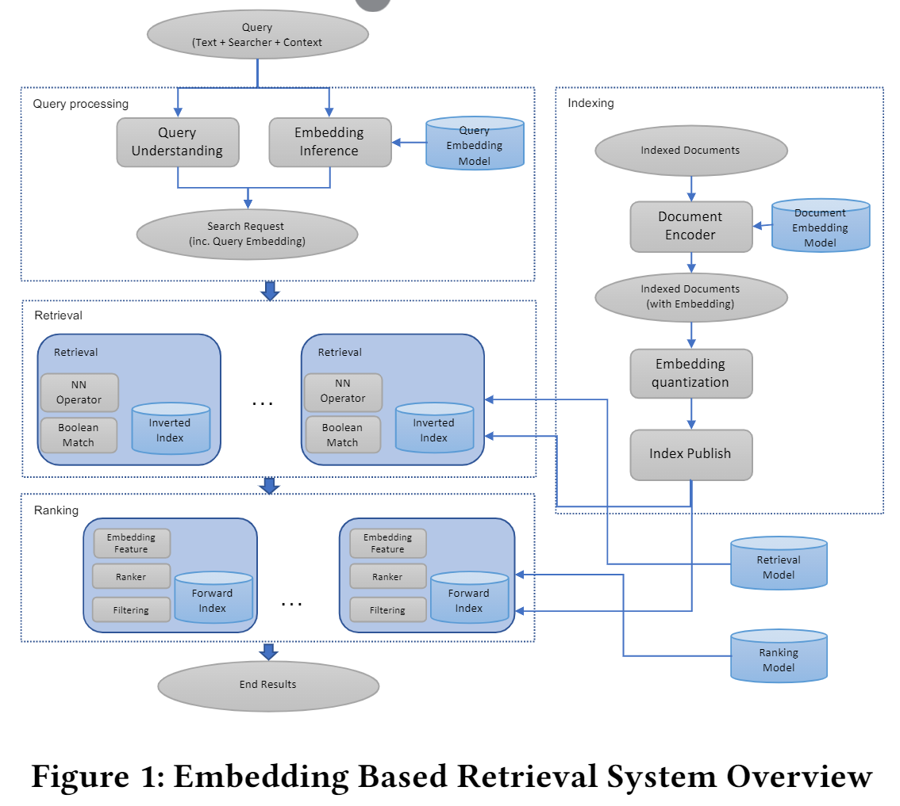
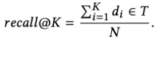
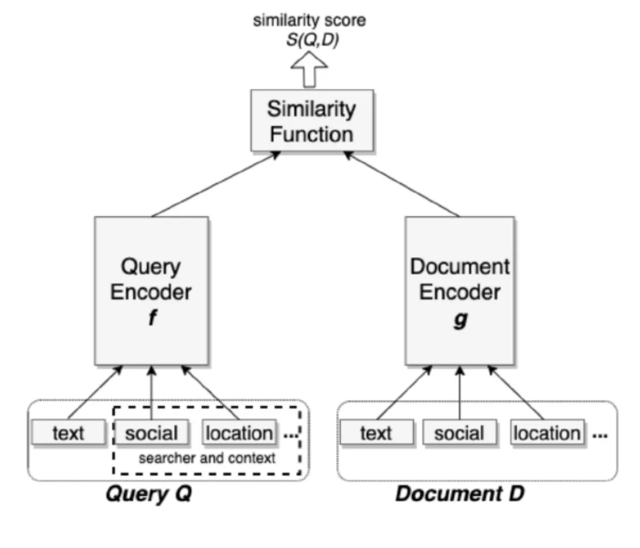
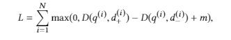
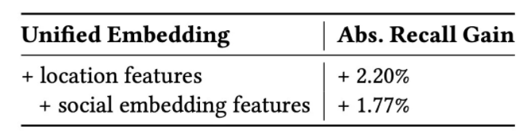
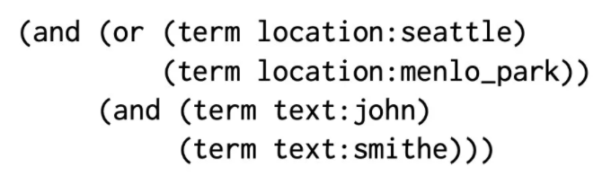

# 【关于 Embedding-based Retrieval in Facebook Search】那些你不知道的事

> 作者：杨夕
> 
> 论文：Embedding-based Retrieval in Facebook Search
> 
> 论文地址：https://dl.acm.org/doi/10.1145/3394486.3403305
> 
> 论文github：
> 
> 推荐系统 论文学习项目地址：https://github.com/km1994/RS_paper_study
> 
> NLP 论文学习项目地址：https://github.com/km1994/nlp_paper_study
> 
> 个人介绍：大佬们好，我叫杨夕，该项目主要是本人在研读顶会论文和复现经典论文过程中，所见、所思、所想、所闻，可能存在一些理解错误，希望大佬们多多指正。
> 
> NLP 面经地址：https://github.com/km1994/NLP-Interview-Notes

> NLP && 推荐学习群【人数满了，加微信 blqkm601 】

- [【关于 Embedding-based Retrieval in Facebook Search】那些你不知道的事](#关于-embedding-based-retrieval-in-facebook-search那些你不知道的事)
  - [一、引言](#一引言)
  - [二、搜索引擎类别介绍](#二搜索引擎类别介绍)
    - [2.1 term matching（文本匹配）](#21-term-matching文本匹配)
    - [2.2 semantic matching（语义匹配）](#22-semantic-matching语义匹配)
  - [三、搜索引擎方法](#三搜索引擎方法)
    - [3.1 搜索引擎方法介绍](#31-搜索引擎方法介绍)
    - [3.2 检索](#32-检索)
    - [3.3 排序](#33-排序)
  - [四、摘要](#四摘要)
  - [五、 在 Facebook 搜索中应用 Embedding-based Retrieval 技术遇到的挑战](#五-在-facebook-搜索中应用-embedding-based-retrieval-技术遇到的挑战)
  - [六、本文搜索引擎建模](#六本文搜索引擎建模)
    - [6.1 问题定位](#61-问题定位)
    - [6.2 Unified Embedding Model](#62-unified-embedding-model)
    - [6.3 损失函数](#63-损失函数)
    - [6.4 正负样本选取策略](#64-正负样本选取策略)
  - [七、特征工程](#七特征工程)
  - [八、在线Serving](#八在线serving)
    - [8.1 线上近似最近邻搜索](#81-线上近似最近邻搜索)
    - [8.2 基于 term 的布尔表达式](#82-基于-term-的布尔表达式)
    - [8.2 优化方案](#82-优化方案)
  - [九、Full-stack优化](#九full-stack优化)
    - [9.1 基于 embedding 召回的结果自然是被次优处理的 问题](#91-基于-embedding-召回的结果自然是被次优处理的-问题)
    - [9.2 基于 embedding 的语义召回模型需要更加深入的分析才能不断提升性能 问题](#92-基于-embedding-的语义召回模型需要更加深入的分析才能不断提升性能-问题)
  - [参考](#参考)

## 一、引言

向量召回技术 主要是将 items(文本、商品、用户等)转化为 embedding，然后召回与目标 item 相似的 候选 item，本文 介绍的是 Facebook 的 向量召回技术，即 Embedding-Based Retrieval（EBR）。该技术 主要用于 搜索引擎、推荐系统等。

## 二、搜索引擎类别介绍

- 搜索引擎匹配策略：按照查询关键词（Query）是否完全命中文档（Document，以下简称doc）
- 类别：
  - term matching（文本匹配）
  - semantic matching（语义匹配）

### 2.1 term matching（文本匹配）

- 介绍：完全精确的匹配（Exact Match）
- 思路【以中文为例】：

1. 分词：对 用户 query 做分词，已或得更细粒度的词（Term）；
2. 检索：分别 采用 词（Term）从 文档库 中检索出 包含 词（Term） 的 Doc;
3. 返回相似度高的 Docs：取各个term检索结果的交集返回；

### 2.2 semantic matching（语义匹配）

- 动机：用户输入的query，只是Ta搜索意图的一种表达形式而已，比如“美国前总统”、“唐纳德・特郎普”、“川普”都是“懂王”。
- 介绍：不再追求完全精确的匹配，而是力图满足用户的搜索意图（Search Intent），也就是意会。
- 思路：

1. 利用 稠密向量（Dense Vector，没有特殊说明，后文的向量都指稠密向量）来表征对象的形式（Representation）；
2. 然后基于query embedding与doc embedding来计算结果；

## 三、搜索引擎方法

### 3.1 搜索引擎方法介绍

搜索引擎方法主要包含：检索和排序

### 3.2 检索

- 目标：如何以低延迟和低计算量的方式从千万个候选集中检索出最相关的 topK 个相关文档；
- 方法：用 embedding 来表示 query 和 doc，然后将检索问题转化为一个在 Embedding 空间的最近邻搜索的问题；
- 难点：
  - 如何构建千万级别的超大规模索引以及如何在线上进行服务；
  - 如何在召回阶段同时考虑语义信息和关键词匹配信息；

### 3.3 排序

- 方法：通过更复杂的算法或模型将最想要的文档排在最前面，通常称为"排序(ranking)"。

## 四、摘要

Search in social networks such as Facebook poses different challenges than in classical web search: besides the query text, it is important to take into account the searcher’s context to provide relevant results. Their social graph is an integral part of this contextand is a unique aspect of Facebook search. While embedding-based retrieval (EBR) has been applied in web search engines for years,Facebook search was still mainly based on a Boolean matching model. 

- In this paper, 
  - we discuss the techniques for applying EBR to a Facebook Search system. 
  - We introduce the unified embedding framework developed to model semantic embeddings for personalized search
  - the system to serve embedding-based retrieval in a typical search system based on an inverted index. We discuss various tricks and experiences on end-to-end optimization of thewhole system, including ANN parameter tuning and full-stack optimization. Finally, we present our progress on two selected advancedtopics about modeling. We evaluated EBR on verticals1 for Facebook Search with significant metrics gains observed in online A/B experiments. We believe this paper will provide useful insightsand experiences to help people on developing embedding-based retrieval systems in search engines

- 动机：
  - 相比于传统的网络搜索，诸如Facebook之类的社交网络中的搜索面临着不同的挑战：除了查询文本外，重要的是要考虑搜索者的上下文以提供相关结果。他们的社交图谱是上下文的组成部分，也是Facebook搜索的独特方面。尽管基于嵌入的检索（EBR）已在Web搜索引擎中应用了很多年，但Facebook搜索仍主要基于布尔匹配模型。
- 论文思路：
  - 提出一种 embedding 框架用于 Facebook Search system 建模个性化搜索中的语义；
  - 提出了基于经典的倒排索引进行在线 embedding 检索的系统；
  - 讨论了整个个性化搜索系统中很多端对端的优化技巧，例如最近邻搜索调参经验、全链路优化等；
- 实验结果：
  - 在Facebook 垂直搜索场景下验证了本文方法的有效性，在线上 A/B 实验取得了显著的收益；

## 五、 在 Facebook 搜索中应用 Embedding-based Retrieval 技术遇到的挑战

- modeling: 本文提出了一套统一的 Embedding 模型框架 ，也就是经典的双塔结构，一侧是抽取用户侧 query 特征；另一侧则是抽取 document 侧的特征。
- serving: 为了优化系统检索和排序的综合效果，Facebook 提出了将 EBR 的 embedding 作为特征整合进 ranking 模型中，以及创建了一套数据反馈机制，以便更好地识别和利用 EBR 的召回结果。
- full-stack optimization: 针对实际的搜索效果优化提出了多个实用的 tricks。

## 六、本文搜索引擎建模

### 6.1 问题定位

- 问题定位：召回优化问题
- 目标：从离线指标的角度，系统 希望最大化 topK 返回结果的recall 指标。给定一个 query，以及期望被检索到的目标文档集合 T，T 中包含的文档可以来自用户的点击数据，也可以是经过人工筛选排序后的文档，优化目标则是 recall@K。

- 问题转化：将召回优化问题建模成 query 和 doc 之间基于距离的排序问题，把 query 和 doc 同时表示成低维稠密的向量，通过计算向量空间中的距离衡量它们之间的 cosine 相似度或相关度

### 6.2 Unified Embedding Model

- 动机：在 Facebook 个性化检索场景下，**仅仅计算 query 本身与候选文档的相似性是远远不够的，还需要考虑用户的上下文信息**，比如他关注的人，他的关注话题等等，才能帮用户找到他真实的最想要的结果。
- 结构：经典的双塔结构
- 思路：

1. query encoder：user 塔的输入包括用户的检索 query，以及用户位置、用户社交关系等上下文特征；
2. document encoder：document 塔的输入包括文档本身，以及文档的 group 信息等上下文特征；
【注：类别型特征，进行 one-hot 或者 multi-hot 的向量化；连续型特征则是直接输入到各自的塔中】
3. similarity function

### 6.3 损失函数

在模型训练的损失函数上，本文定义了一个三元组损失函数，使得负例比正例相对 query 的距离尽可能的远。在使用三元组损失函数的情况下，使用随机采样的负样本可以近似求解召回优化问题。

### 6.4 正负样本选取策略

- 正样本选取策略：用户点击样本；
- 负样本选取策略：
  - random samples 随机负样本：随机从文档库中采样 document 作为负样本；
  - non-click impressions 未点击的曝光数据：随机采样在同一个 session 中曝光但未点击的样本作为负样本；

本文发现前者作为负样本的效果要明显好于后者，原因是前者可以有效消除负样本偏差。另外，本文还进行了一组把曝光但是未点击的样本作为正样本的实验，实验结果表明并没有带来额外的收益。

## 七、特征工程

Unified Embedding Model 架构的一个最明显的优势是可以任意加入各种各样的上下文特征。我们都知道 Facebook 推出的工业界实战论文都比较注重特征工程，Unified Embedding 大体上采用了如下三个方面的特征：

1. Text features

Text Embedding 采用 char n-gram，相对于 word n-gram 有两方面的优势：

- 一是有限的词典，char embedding table 会比较小，训练更高效；
- 二是不会有 OOV 问题，subword 可以有效解决拼写错误以及单词的多种变体引入的 OOV 问题。

2. Location features

位置特征对于搜索引擎的很多场景是非常重要的，因此本文在 query 和 document 侧的都加入了 location 的特征。

3. Social Embedding features

为了有效利用 Facebook 社交网络中的丰富信息，本文额外地训练了一个社交网络的 Graph Embedding，然后将这个预训练的 Embedding 作为特征输入到模型当中。

## 八、在线Serving

### 8.1 线上近似最近邻搜索

- 方法： Faiss 库进行线上近似最近邻搜索（approximate nearest neighbor search， ANN）
- 思路：
  - 利用自家的 Faiss 库创建向量索引；
  - 然后对索引表进行高效的最近邻检索；
- 优点：
  - 对 embedding 进行量化可以有效节省存储开销；
  - 方便集成到现有的基于倒排索引的检索系统中。

### 8.2 基于 term 的布尔表达式

一个 query 可以表示为基于 term 的布尔表达式，譬如 john 和 smithe 住在 seattle 或者 menlo_park 可以用下面的布尔表达式来表示。在实际使用中，在 document 的布尔表示基础上，加上了 document embedding 的索引。

### 8.2 优化方案

- 动机：Embedding model 离线训练完成后通过 spark 构建候选文档集 document 的索引，当用户请求过来时，query 的 embedding 在线计算，进行 topK 召回。针对**全量的候选文档集进行索引是非常耗存储和费时**的，
- 优化：在构建索引的时候，只选择了月活用户，近期事件，热门的事件，以及热门 group。大部分公司在构建索引的时候也都会采取这样的策略，很多长时间不活跃的可以不构建索引。

## 九、Full-stack优化

### 9.1 基于 embedding 召回的结果自然是被次优处理的 问题

- 动机一：Facebook 的搜索引擎可以看作是一个复杂的多阶段的排序系统，检索是排序之前的流程，检索得到的结果需要经过排序层的过滤和 ranking，将检索过程召回的分数（也就是向量的相似度）作为 ranking 阶段的一个特征，通过 ranking 模型进行统一排序。由于现有的排序算法是基于已有的检索算法的特点设计的，所以**对于基于 embedding 召回的结果自然是被次优处理的**
- 解决方法：
  - Embedding as ranking feature: 将检索这一步骤得到的 embedding similarity 作为接下来排序的输入特征，实验证明余弦相似度的效果要优于其他相似度特征；
  - Training data feedback loop: 基于 embedding 的语义召回的结果存在召回高但是精度低的问题，所以本文就采用了对召回结果进行人工标注的方法，对每个query召回的结果进行标注，区分相关结果和不相关结果，然后用标注后的数据重新训练模型，从而提升模型精度。（人工大法好）

### 9.2 基于 embedding 的语义召回模型需要更加深入的分析才能不断提升性能 问题

- 动机二：基于 embedding 的语义召回模型需要更加深入的分析才能不断提升性能
- 优化方向：一个是 Hard Mining，另一个是 Embedding Ensemble。具体地有以下几个方法：
  - Hard Negative Mining 文章发现很多时候同语义召回的结果，大部分都是相似的，而且没有区分度，最相似的结果往往还排不到前面，这些就是之前的训练样本太简单了，导致模型学习的不够充分。所以本文把那些和 positive sample 很近的样本作为负样本去训练，这样模型就能学到这种困难样本的区分信息。
  - Online hard negative mining 模型是采用mini-batch的方式进行参数更新的，对batch中每个positive pair (q_i, d_i)，利用除 d_i 以外的其他正例文档组成一个文档集，从中选择最相近的文档作为困难负例 hard negative sample，通过这种方式构造的三元组数据 可以使模型效果提升非常明显，同时也注意到了每个 positive pair，最多只能有两个 hard negative sample，不然模型的效果会下降。
  - Offline hard negative mining 首先针对每个 query 召回 topK 个结果；然后选择一些 hard negative samples 进行重新训练，重复整个过程。同时根据经验负例样本的比例是 easy : hard=100:1。
  - Hard positive mining 模型采用了用户点击的样本为正样本，这一部分样本是现有系统已经可以召回的相对简单样本，但是还有一些用户未点击但是也能被认为是正样本的样本。作者从用户日志中挖掘出潜在的困难正样本（具体如何挖掘文章没有提及），发现训练数据量只有原来 4% 的情况下可以得到和原来相近的召回率，如果把这些困难正例和用户点击数据一起训练说不定有更好的效果。
  - Embedding Ensemble 简单样本和困难样本对训练 EBR 模型都很重要，简单样本可以让模型快速学习到数据分布特点，困难样本可以提升模型的 precision，所以采用不同难度的正负样本训练出来的模型各有优势，如何对这些模型进行融合以提升性能呢？第一种方案是 Weighted Concatenation，通过对不同模型计算的相似度 score 进行加权平均作为最终相似度值，采用加权融合的模型对于单模型而言有 4.39% 的提升。第二种方案是 Cascade Mode，模型以串行方式在第一阶段模型的输出上运行第二阶段模型。采用串行的方式，模型也有 3.4% 的提升。

## 参考

1. [【PaperNotes】Embedding-based Retrieval in Facebook Search](https://zhuanlan.zhihu.com/p/374684685)
2. [《Embedding-based Retrieval in Facebook Search》阅读笔记](http://wulc.me/2020/08/30/《Embedding-based%20Retrieval%20in%20Facebook%20Search》阅读笔记/)
3. [Embedding-based Retrieval in Facebook Search](https://zhuanlan.zhihu.com/p/152570715)
4. [Embedding-based Retrieval in Facebook Search：解读Facebook搜索中的召回技术](https://blog.csdn.net/weixin_41089007/article/details/108292704)
5. [Embedding-based Retrieval in Facebook Search 论文阅读笔记【论文翻译】](https://blog.csdn.net/weixin_40548136/article/details/108512475)
6. [KDD2020 | 揭秘Facebook搜索中的语义检索技术](https://mp.weixin.qq.com/s/VJSDSHW3CsY3b5Xx90FO2A)
